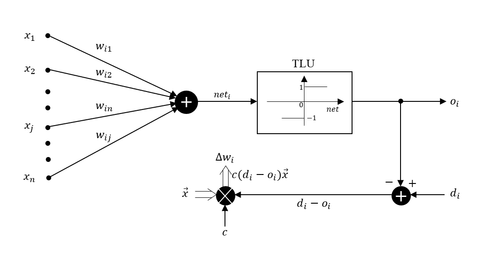
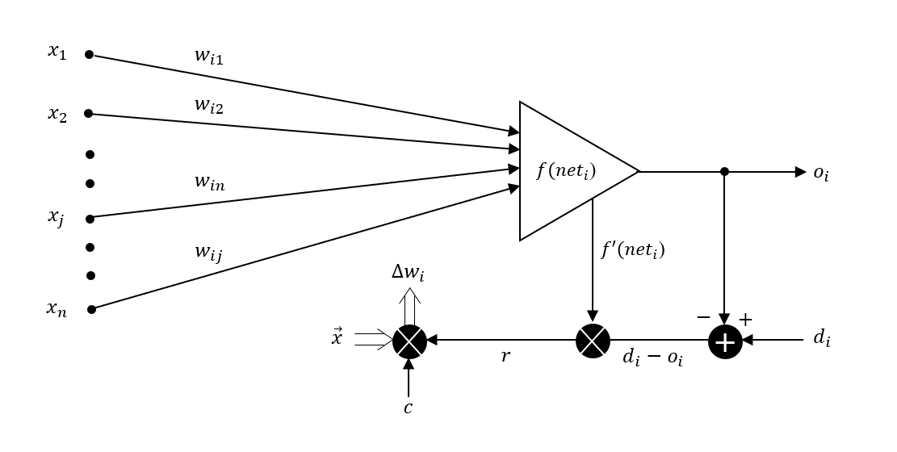
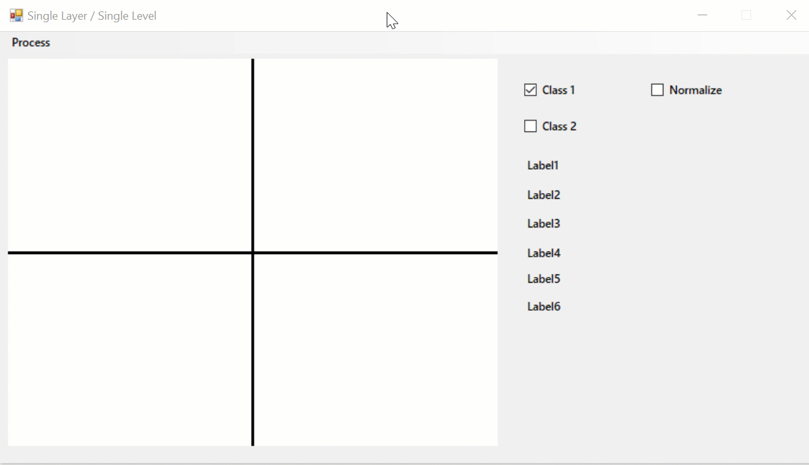
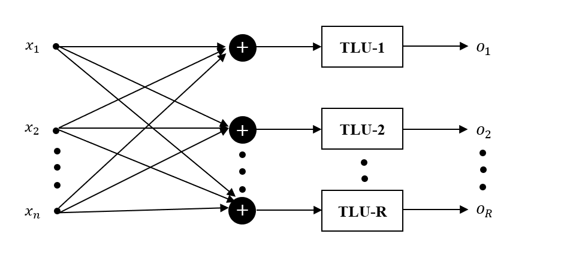
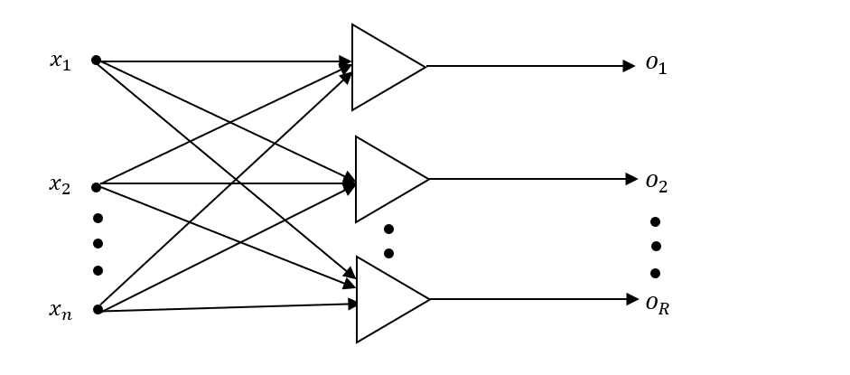
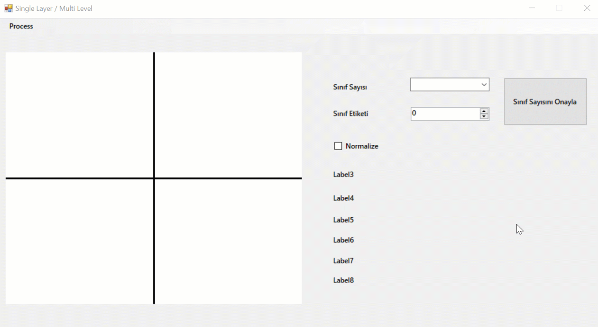

# Artificial Neural Networks

Tek katmanlı yapay sinir ağı ile iki sınıfı yada daha fazla sınıfı perceptron ve delta learning algoritmalarını kullanarak birbirinden ayrıştırmayı/sınıflandırmayı(classification) içerir. 

## Single Layer – Single Level

İlk olarak 2-boyutlu bir düzlemde işlem gerçekleştirebilmek için bir Form ekranı oluşturdum. Daha sonra ana eksen doğrularını çizdirmek için pictureBox'ın event özelliğine gelip paint kısmına çift tıklayarak **pictureBox1_Paint_1** fonksiyonunda gerekli işlemleri gerçekleştirdim. Form ekranı yükleniyorken; yani ilk çalıştırıldığında toplam örnek sayısı, class1 ve class2’deki örnek sayıları 0 olarak setlenmiş bir şekilde gelecek şekilde ayarladım.

Sonrasında 2-boyutlu düzlem üzerinde örneklerimizi çizdirebilmek için pictureBox’ın event özelliğine gelip mouse click kısmına çift tıklayarak **pictureBox1_MouseClick** fonksiyonunda gerekli işlemleri gerçekleştirdim. Burada örneklerimizin çizdiğimiz ana eksen doğrularına göre doğru koordinatları alabilmesi için, noktaları ana eksenin merkezine taşıdım ve **check_Class1** ve **check_Class2** ile de çizilen örneklerin hangi sınıfa ait olarak çizileceğini ayarladım. Resource.h dosyasında ise CLASS1 için 0 ve CLASS2 için ise 1 tanımlamalarını gerçekleştirdim. Her örnek çizdirildiğinde ilgili sınıftaki örnek sayısı ile toplam örnek sayısı artırılarak label2’de gösterilmesini sağladım.

Eğitim işlemine geçmeden önce ana eksen üzerinde iki sınıfı birbirinden ayırmak için kullanacağımız doğruyu **ramdomlyToolStripMenuItem_Click** fonksiyonuyla çizdirdim. Çizdirme işlemini doğrunun denklemiyle (w0x1 + w1x2 + w2 = 0) hesaplıyoruz.

Y koordinatlarını ise **Resource.h** dosyasındaki **YPoint **fonksiyonuyla hesapladım.

### Ayrık Aktivasyon Fonksiyonlu
Ayrık aktivasyon fonksiyonlu eğitim işlemini **binaryDiscToolStripMenuItem_Click** fonksiyonunda gerçekleştirdim. İlk olarak pictureBox’ı refresh ederek tüm örnekleri, ilgili rengiyle yeniden bulundukları konuma çizdim. Daha sonrasında ise cycle, allCyclesDone değişkenlerini tanımlayarak döngü içerisinde örnek sayısı kadar değer içeren training_done adında pointer dizisi oluşturdum. Örnek sayısı kadar çalışan döngüde, her örnek için **perceptronRule** fonksiyonuna gidilir ve eğitim işlemi gerçekleştirilerek training_done dizisine ilgili örnek için eğitim tamamladıysa 1 değeri atanır. Tüm örnekler için fonksiyon 1 degerini döndürdüyse döngüden çıkılır. Döngüden çıkıldığında, döngüde tanımlanan j değişkeni kaç ise eğitimdeki toplam cycle(epoch) sayısı odur.

**perceptronRule.cpp**'de yer alan perceptronRule fonksiyonunun biraz daha detayına inecek olursam;

**perceptronRule** fonksiyonu 3 adet parametre alır; bunlardan ilki tüm örneklerin özelliklerini barındıran, içerisinde x1, x2 ve id değişkenleri yer alan Samples yapısıdır. (Samples yapısı **Resource.h** içerisinde yer alır.) Diğer parametreler ise ağırlık katsayıları ve c öğrenme sabitidir.
Burada bias katsayısını 1, öğrenme sabitini 0.1 olarak aldım.

Eğitim işleminde ilk olarak örneklerin koordinatları(x1, x2) ve bias katsayısı ile **ramdomlyToolStripMenuItem_Click** fonksiyonunda elde ettiğimiz ağırlık değerlerini çarpılıp toplanarak net değeri elde edilir.

	net = w[0] * x1 + w[1] * x2 + w[2] * bias

Daha sonra elde edilen net değeri **Process.cpp**’de yer alan **sgn**(işaret) fonksiyonuna tabi tutularak output elde edilir. Eğer sonuç 0’dan büyükse output 1, değilse 0 değerini alır.

	output = sgn(net)

Burada **desired_output** yani beklenen çıktılar, Resource.h’da yer alan CLASS1 için 0, CLASS2 1 değerleridir. Eğer beklenen çıktı ile output eşitse mevcut için öğrenme tamamlanmıştır ve fonksiyon 1 değeri verir; eğer değilse ağırlık katsayıları tekrardan güncellenerek adımlar bir kez daha uygulanır.

	w[i+1]= w[i] +c * (desired_output - output) * x

Bu işlem her örnek için beklenen çıktı ile output eşit olana kadar devam eder. Eğitim işlemi tamamlandıktan sonra iki sınıfı birbirinden ayıran doğru parçası pictureBox'ta çizdirilir.

### Sürekli Aktivasyon Fonksiyonlu
Sürekli aktivasyon fonksiyonlu eğitim işlemini **continiousToolStripMenuItem_Click** fonksiyonunda gerçekleştirdim. Örnekleri verip, rastgele doğruyu çizdikten sonra Normalize checkBox’ını işaretlenmesi gerekir, aksi takdirde ekrana uyarı mesajı verilmektedir. Normalize edildiğinde bütün örneklerin x,y değerleri ekranın genişline(pictureBox1->Width) bölünüyor. İlk olarak pictureBox’ı refresh ederek tüm örnekleri, ilgili rengiyle yeniden bulundukları konuma çizdim. Daha sonrasında ise cycle, allCyclesDone değişkenlerini tanımlayarak döngü içerisinde örnek sayısı kadar değer içeren training_done adında pointer dizisi oluşturdum. Örnek sayısı kadar çalışan döngüde, her örnek için **deltaRule** fonksiyonuna gidilir ve eğitim işlemi gerçekleştirilerek training_done dizine ilgili örnek için eğitim tamamladıysa 1 değeri atanır. Tüm örnekler için fonksiyon 1 degerini döndürdüyse döngüden çıkılır. Döngüden çıkıldığında, döngüde tanımlanan j değişkeni kaç ise eğitimdeki toplam cycle(epoch) sayısı odur.

**deltaRule.cpp**’de yer alan deltaRule fonksiyonunun biraz daha detayına inecek olursam;

Eğitim işleminde ilk olarak örneklerin koordinatları(x1, x2) ve bias katsayısı, ağırlık katsayıları çarpılıp toplanarak net değeri elde edilir. Daha sonra elde edilen net değeri **Process.cpp**’de yer alan sigmoid fonksiyonuna tabi tutularak output elde edilir.

Eğer beklenen çıktı ile output arasındaki fark deltaRule.h dosyasında tanımladığım**IS_EQUAL** makrosunda belirttiğim 0.4’ten az ise öğrenme tamamlanmıştır ve fonksiyon 1 değeri verir; eğer değilse ağırlık katsayıları tekrardan güncellenerek adımlar bir kez daha uygulanır.

	w[i+1]= w[i] +c * (desired_output - output) * sigmoid' * x

Delta öğrenme kuralında, perceptrondan farklı olarak ağırlık katsayıları güncellenirken türevi 0’dan farklı olan bir aktivasyon fonksiyonu kullanılır. deltaRule fonksiyonu her örnek için beklenen çıktı ile output arasındaki fark 0.4 hata payından az olana kadar devam eder. Eğitim işlemi tamamlandıktan sonra YPoint fonksiyonuna 3.parametre olarak ekranın genişliğini
girdim, böylece ekranın genişliğine bölünen x,y değerleri tekrar ekran genişliği ile çarpılarak eski değerlerine kavuşturdum ve iki sınıfı birbirinden ayıran doğru parçasını pictureBox’ta çizdirdim.

## Single Layer – Multi Level
İlk olarak 2-boyutlu bir düzlemde işlem gerçekleştirebilmek için bir Form ekranı oluşturdum. Daha sonra ana eksen doğrularını çizdirmek için pictureBox’ın event özelliğine gelip paint kısmına çift tıklayarak **pictureBox1_Paint_1** fonksiyonunda gerekli işlemleri gerçekleştirdim. Form ekranı yükleniyorken; yani ilk çalıştırıldığında toplam örnek sayısı, sınıf sayısı ve sınıf etiketini 0 olarak setlenmiş bir şekilde gelecek şekilde ayarladım. Toplam kaç sınıf üzerinde işlem yapacağımızı **comboBox**’tan seçip index değerini 1 artırarak **classCount** değişkenine atayıp buton ile onaylama işlemini uyguladım. Hangi sınıfın hangi etikete sahip olacağını ise **numericUpDown**’daki değerin 1 eksini alarak **classLabel**değişkeninde tuttum.
Sonrasında 2-boyutlu düzlem üzerinde örneklerimizi çizdirebilmek için pictureBox’ın event özelliğine gelip mouse click kısmına çift tıklayarak pictureBox1_MouseClick_1 fonksiyonunda gerekli işlemleri gerçekleştirdim. Burada örneklerimizin çizdiğimiz ana eksen doğrularına göre doğru koordinatları alabilmesi için, noktaları ana eksenin merkezine taşıdım. Bütün örnekler swich case ile etiketlerine göre belirlenen renklerde çizdirilmesini uyguladım.
Her örnek çizdirildiğinde ilgili sınıftaki örnek sayısı ile toplam örnek sayısı artırılarak**label4**'de gösterilmesini sağladım.

Daha sonra ana eksen üzerinde sınıfları birbirinden ayırmak için kullanacağımız doğruları **ramdomlyToolStripMenuItem_Click** fonksiyonuyla çiziyoruz. Çizdirme işlemini doğrunun denklemiyle (w0x1 + w1x2 + w2 = 0) hesaplıyoruz.

Her sınıf için ayrı ayrı ağırlık katsayılarını rastgele oluşturdum. X koordinatları pictureBox’ın genişliği boyuncadır(x1 = 0, x2 = 500). Y koordinatlarını ise **Resource.h** dosyasındaki **YPoint** fonksiyonunla hesapladım. Swich case ile ilgili sınıfa göre aynı renkte doğruları çizdirdim.

### Ayrık Aktivasyon Fonksiyonlu
Ayrık aktivasyon fonksiyonlu eğitim işlemini **binaryDiscToolStripMenuItem_Click_1** fonksiyonunda gerçekleştirdim. İlk olarak pictureBox’ı refresh ederek tüm örnekleri, ilgili rengiyle yeniden bulundukları konuma çizdim. Daha sonra örnek sayısı kadar elemana sahip tmp_sample adında bir pointer dizisi oluşturdum. Tüm örneklerin koordinatlarını oluşturmuş olduğum tmp_sample pointer dizisindeki koordinatlara aktardım; eğer döngüdeki category değişkenin değeri mevcut örneğin id'sine eşitse, yani aynı sınıftaysa tmp_sample’daki mevcut örneğin etiketini 1, geri kalanını 0 yapar. Böylece eğitim yapılırken ilgili sınıfın, diğerlerinden ayrıştırılması sağlanır. (Bire karşı hepsi mantığı uygulanır.)

Örnek sayısı kadar çalışan döngüde, her örnek için **perceptronRule** fonksiyonuna gidilir ve eğitim işlemi gerçekleştirilerek training_done dizine ilgili örnek için eğitim tamamladıysa 1 değeri atanır. Tüm örnekler için fonksiyon 1 degerini döndürdüyse döngüden çıkılır. Döngüden çıkıldığında, döngüde tanımlanan j değişkeni kaç ise eğitimdeki toplam cycle(epoch) sayısı odur.

**perceptronRule.cpp**’de yer alan perceptronRule fonksiyonunun biraz daha detayına inecek olursam;

**perceptronRule** fonksiyonu 3 adet parametre alır; bunlardan ilki tüm örneklerin özelliklerini barındıran, içerisinde x1, x2 ve id değişkenleri yer alan Samples yapısıdır. (Samples yapısı **Resource.h** içerisinde yer alır.) Diğer parametreler ise ağırlık katsayıları ve c öğrenme sabitidir.
Burada bias katsayısını 1, öğrenme sabitini 0.1 olarak aldım.

Eğitim işleminde ilk olarak örneklerin koordinatları(x1, x2) ve bias katsayısı ile **ramdomlyToolStripMenuItem_Click** fonksiyonunda elde ettiğimiz ağırlık değerlerini çarpılıp toplanarak net değeri elde edilir.

	net = w[0] * x1 + w[1] * x2 + w[2] * bias

Daha sonra elde edilen net değeri **Process.cpp**’de yer alan **sgn**(işaret) fonksiyonuna tabi tutularak output elde edilir. Eğer sonuç 0’dan büyükse output 1, değilse 0 değerini alır.

	output = sgn(net)

Burada desired_output yani beklenen çıktılar, tmp_sample pointer’ının id değerleridir. Eğer beklenen çıktı ile output eşitse mevcut için öğrenme tamamlanmıştır ve fonksiyon 1 değeri verir; eğer değilse ağırlık katsayıları tekrardan güncellenerek adımlar bir kez daha uygulanır.

### Sürekli Aktivasyon Fonksiyonlu
Sürekli aktivasyon fonksiyonlu eğitim işlemini **continiousToolStripMenuItem_Click** fonksiyonunda gerçekleştirdim. Örnekleri verip, rastgele doğruyu çizdikten sonra Normalize checkBox’ını işaretlenmesi gerekir, aksi takdirde ekrana uyarı mesajı verilmektedir. Normalize edildiğinde bütün örneklerin x,y değerleri ekranın genişline(pictureBox1->Width) bölünüyor. İlk olarak pictureBox’ı refresh ederek tüm örnekleri, ilgili rengiyle yeniden bulundukları konuma çizdim. Daha sonrasında ise cycle, allCyclesDone değişkenlerini tanımlayarak döngü içerisinde örnek sayısı kadar değer içeren training_done adında pointer dizisi oluşturdum. Örnek sayısı kadar çalışan döngüde, her örnek için **deltaRule** fonksiyonuna gidilir ve eğitim işlemi gerçekleştirilerek training_done dizine ilgili örnek için eğitim tamamladıysa 1 değeri atanır. Tüm örnekler için fonksiyon 1 degerini döndürdüyse döngüden çıkılır. Döngüden çıkıldığında, döngüde tanımlanan j değişkeni kaç ise eğitimdeki toplam cycle(epoch) sayısı odur.

**deltaRule.cpp**’de yer alan deltaRule fonksiyonunun biraz daha detayına inecek olursam;

Eğitim işleminde ilk olarak örneklerin koordinatları(x1, x2) ve bias katsayısı, ağırlık katsayıları çarpılıp toplanarak net değeri elde edilir. Daha sonra elde edilen net değeri **Process.cpp**’de yer alan **sigmoid** fonksiyonuna tabi tutularak output elde edilir.

Eğer beklenen çıktı ile output arasındaki fark **deltaRule.h** dosyasında tanımladığım **IS_EQUAL** makrosunda belirttiğim 0.4’ten az ise öğrenme tamamlanmıştır ve fonksiyon 1 değeri verir; eğer değilse ağırlık katsayıları tekrardan güncellenerek adımlar bir kez daha uygulanır.

	w[i+1]= w[i] +c * (desired_output - output) * sigmoid' * x

Delta öğrenme kuralında, perceptrondan farklı olarak ağırlık katsayıları güncellenirken türevi 0’dan farklı olan bir aktivasyon fonksiyonu kullanılır. deltaRule fonksiyonu her örnek için beklenen çıktı ile output arasındaki fark 0.4 hata payından az olana kadar devam eder. Eğitim işlemi tamamlandıktan sonra YPoint fonksiyonuna 3.parametre olarak ekranın genişliğini
girdim, böylece ekranın genişliğine bölünen x,y değerleri tekrar ekran genişliği ile çarpılarak eski değerlerine kavuşturdum ve iki sınıfı birbirinden ayıran doğru parçasını pictureBox’ta çizdirdim.

